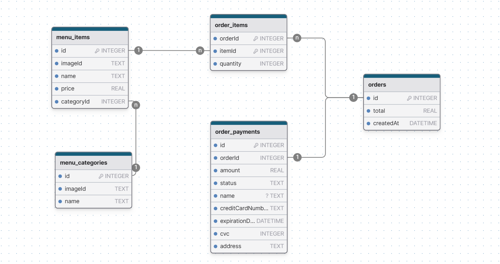

# API Service

The API service is built using NestJS, a progressive Node.js framework for building efficient and scalable server-side applications. It provides a RESTful API for the web frontend to interact with, handling business logic and data persistence.

- [Directory Structure](#directory-structure)
- [Technical Stack](#technical-stack)
- [Database](#database)
- [API Endpoints](#api-endpoints)
- [Development](#development)
- [Testing](#testing)


## Directory Structure

```
.
├── assets/                # Static assets served by the API
├── prisma/                # Prisma ORM configurations and migrations
│   ├── migrations/        # Database migration files
│   ├── schema.prisma      # Prisma schema definition
│   └── seed.ts            # Database seeding script
└── src/                   # Source code
    ├── core/              # Core functionality and shared code
    ├── menu/              # Menu feature module
    ├── order/             # Order feature module
    ├── utils/             # Utility functions and helpers
    ├── app.module.ts      # Main application module
    └── main.ts            # Application entry point
```

## Technical Stack

- **Framework**: NestJS/NodeJS
- **Language**: TypeScript
- **ORM**: Prisma
- **Database**: SQLite (for development simplicity)
- **API Documentation**: Swagger/OpenAPI
- **Testing**: Jest

## Database

The service uses SQLite as the database for development and demonstration purposes. In a production environment, a more robust RDBMS like PostgreSQL or MySQL would be recommended. The database schema is managed through Prisma ORM.

### Entity Relationship Diagram



## API Endpoints

| Endpoint | Method | Description |
|----------|--------|-------------|
| `/menu` | GET | Retrieves menu items and their respective categories. |
| `/order` | POST | Creates an order with payment information. |
| `/assets/[image-id].[extension]` | GET | Serves static images for menu items and categories. |

Full API documentation is available at `/api/docs` when the service is running.

## Development

### Prerequisites

- Node.js (version specified in package.json)
- pnpm package manager
- Access to the root repository

### Setup

1. From the root of the monorepo, install dependencies:
   ```bash
   pnpm install
   ```

2. Copy the environment variables file:
   ```bash
   cp .env.example .env
   ```

3. Prepare the database:
   ```bash
   pnpm db:prepare
   ```

### Running the Service
To run this service as a standalone, use the commands bellow.

```bash
# Development mode
pnpm dev

# Production build
pnpm build

# Run production build
pnpm start
```

## Testing

```bash
# Run unit tests
pnpm test

# Run tests with coverage
pnpm test:cov

# Run tests in watch mode
pnpm test:watch
```

End-to-end tests are planned as a future enhancement.
